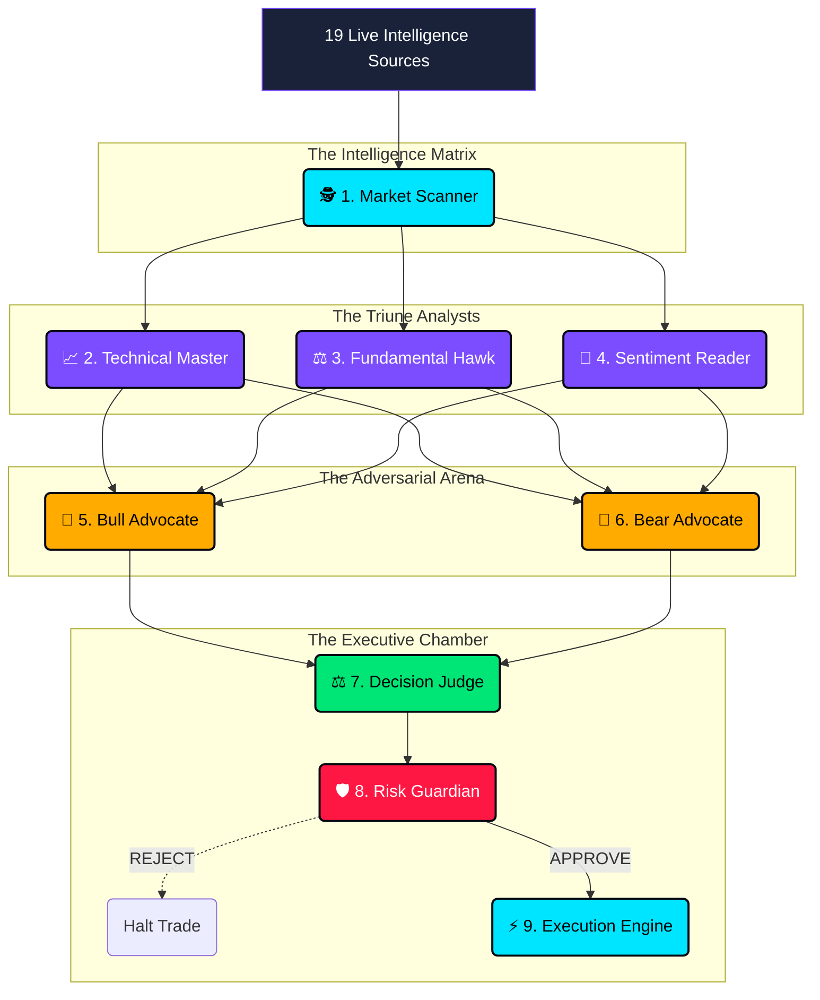

<div align="center">

```
████████╗██╗████████╗ █████╗ ███╗   ██╗
╚══██╔══╝██║╚══██╔══╝██╔══██╗████╗  ██║
   ██║   ██║   ██║   ███████║██╔██╗ ██║
   ██║   ██║   ██║   ██╔══██║██║╚██╗██║
   ██║   ██║   ██║   ██║  ██║██║ ╚████║
   ╚═╝   ╚═╝   ╚═╝   ╚═╝  ╚═╝╚═╝  ╚═══╝
```

# TITAN AI v2.0: The Apex Autonomous Trading Entity
### *God-Level Multi-source Intelligence • 8-Agent Adversarial Council  • Zero-Compromise Risk Management*

[](https://www.python.org/downloads/)
[](https://fastapi.tiangolo.com)
[](https://langchain-ai.github.io/langgraph/)
[](https://ai.google.dev/)
[](LICENSE)
[](#)

</div>

---

## 🔮 The Paradigm Shift in Autonomous Trading

**TITAN AI** is not merely an algorithmic bot; it is a **Masterpiece of Multi-Agent Orchestration**, designed to bring institutional-grade, billion-dollar hedge fund capabilities directly to your browser. By leveraging **Google Gemini 3.1 Pro** via a highly intellectual **LangGraph** framework, TITAN fuses instantaneous multi-source intelligence gathering with rigorous adversarial debate to achieve unparalleled precision in the Indian Stock Market (NSE/BSE).

When activated, the AI doesn't just read charts—it synthesizes **19 independent data streams in seconds**, calculates intrinsic valuations, parses real-time sentiment, constructs opposing arguments (Bull vs. Bear), and ultimately executes with cold, calculated precision under a non-overridable God-level risk management framework.

---

## 🌐 The Omni-Source Intelligence Matrix

To assure complete trust and flawless decision-making, TITAN aggregates live, high-fidelity data from a curated list of top-tier market intelligence sources before executing a single trade:

### 1. Comprehensive Analysis & Screening
- **Tickertape:** In-depth fundamental data, peer comparisons, and ETF metrics.
- **Screener.in:** Real-time financial statement parsing and custom algorithmic filters.
- **Trendlyne:** Advanced DVM (Durability, Valuation, Momentum) scoring and insider tracking.
- **MarketMojo:** Granular quality analysis and financial trend reporting.
- **StockEdge:** Post-market robust analytics and live market tracking.

### 2. High-Frequency Technicals & Charting
- **TradingView:** Global indicator synthesis and moving average alignments.
- **Chartink:** Proprietary real-time candlestick pattern recognition.
- **GoCharting:** Advanced Volume Profile and Order Flow dynamics.
- **Interactive Brokers (TWS):** Institutional-grade quantitative modelling.

### 3. News, Sentiment & Meta-Data
- **Moneycontrol:** Live Indian domestic news flow and forum sentiment.
- **NSE/BSE India:** Ground-source truth for volume, delivery, and derivative OI data.
- **ET Markets:** Macro-economic trend analysis and sector rotation insights.
- **Investing.com:** Global macro indicators, currency indices, and crypto correlations.

### 4. Broker-Led Research & AI Screening
- **ICICI Direct / Angel One / Sharekhan:** Aggregated institutional research and street consensus.
- **AlgoScreeners:** AI-based quantitative opportunity detection.
- **Morningstar:** Detailed intrinsic value modeling.

---

## 🧠 Architecture: The 8-Agent Adversarial Council

TITAN replaces human emotional bias with a mathematical, adversarial debate mechanism. Every potential trade must survive the **Council Protocol**.



### The Roles:
1. **Market Scanner:** Instantly filters the NSE/BSE universe for volume/momentum anomalies.
2. **Technical Analyst:** Evaluates multi-timeframe confluence, RSI, MACD, and EMA stacks.
3. **Fundamental Analyst:** Runs instant DCF, PE, and ROCE checks against sector medians.
4. **Sentiment Analyst:** Parses breaking news NLP and calculates the Fear & Greed Index.
5. **Bull Advocate:** Instructed to greedily formulate the strongest possible case *for* buying.
6. **Bear Advocate:** Instructed to ruthlessly tear down the trade and expose all hidden risks.
7. **Decision Judge:** The unbiased arbiter that weighs both arguments and calculates an execution Conviction Score.
8. **Risk Manager:** A hardcoded, deterministic firewall. If the trade violates capital rules, it is instantly killed.

---

## 💎 Award-Winning Premium UI / UX

The TITAN agent interfaces with the real world through an ultra-premium, deeply immersive Chrome Extension widget injected directly over your preferred broker (Zerodha Kite or Groww).

### 🎯 Pre-Start Loss Tolerance Protocol
TITAN treats your capital as sacred. Before the engine ignites, the user must define:
1. **Daily Profit Target (₹):** The agent secures gains when the threshold is hit.
2. **Maximum Loss Tolerance (₹):** The ultimate kill-switch parameter.

### 🚨 Real-Time Loss Meter & Visual Warnings
- **The Loss Meter:** A dynamic, color-shifting progress bar tracking distance to the hard-stop.
- **Amber Phase (80%):** At 80% loss tolerance, the interface shifts to an amber warning state, reducing position sizes automatically.
- **Red Phase (100%):** If the limit is struck, a **FullScreen Emergency Overlay** deploys, halting all algorithm operations entirely to prevent over-trading and emotional revenge sizing.

### 📱 Cinematic Visualization Engine
- **Draggable Glassmorphism Panel:** Fluid drag-to-move capabilities across your dashboard.
- **Live Sync Animation:** Watch the agent hook into all 19 databases in real-time.
- **Reasoning Log:** Read the exact inner monologue and debate occurring between the 8 agents in fractions of a second.
- **Regime Detection:** Instantly identifies if the market is *Trending Up, Trending Down, Ranging, or highly Volatile*.

---

## 🛠️ Technology Stack

- **AI Core:** Google Gemini 3.1 Pro via `google-genai`
- **Orchestration:** LangChain / LangGraph TypedDict reducers
- **Backend Protocol:** FastAPI + AsyncIO WebSocket multiplexing
- **Database Layer:** SQLAlchemy (PostgreSQL) + Redis (PubSub/Cache) + ChromaDB (Vector logs)
- **Frontend Extension:** Vanilla JS/CSS Injection with luxury `Outfit` and `Inter` typography
- **Broker Connectivity:** Kite Connect (Zerodha) and Groww APIs

---

## 🚀 Quick Start & Deployment

### 1. Repository Setup

```bash
git clone https://github.com/your-username/titan-trading-agent.git
cd titan-trading-agent

# Create isolated environment
python -m venv .venv
source .venv/bin/activate  # Windows: .venv\Scripts\activate

# Install core dependencies
pip install -e .
```

### 2. Environment Configuration
Create a `.env` file from the example:
```bash
cp .env.example .env
```
Ensure you provide your **`GEMINI_API_KEY`**. 

### 3. Ignition
Boot the FastAPI application and backend orchestrator:
```bash
python main.py --mode paper --port 8080
```
*(The system defaults to a hyper-realistic Paper Trading simulator to guarantee zero capital loss during evaluation).*

### 4. Inject the Interface
1. Open Google Chrome and navigate to `chrome://extensions/`
2. Enable **Developer Mode**.
3. Click **Load Unpacked** and select the `/extension` directory in this repository.
4. Open [Groww.in](https://groww.in/) or [Kite.Zerodha.com](https://kite.zerodha.com/).
5. Click the glowing **T** icon in the bottom right corner to unleash TITAN.

---

## 🔐 SEBI Compliance & Safety Firewalls

TITAN operates strictly within the paradigm of high-compliance algorithmic trading:
- **Absolute Circuit Breakers:** The Risk Manager node cannot be bypassed by the AI.
- **Algo Tagging:** All orders executed on live exchanges carry the `TITAN_V2_ALGO` tracker.
- **Rate Limit Safety:** Throttles API requests to prevent exchange punitive bans.
- **Hard Stop Enforcement:** The pre-start configuration parameters create a physical wall the algorithm cannot cross. 

---

<div align="center">

*This system is a technological demonstration of cutting-edge AI orchestration. While the reasoning engine is immense, financial markets carry inherent absolute risks.*

**Designed for the future of algorithmic capital management.** <br>
**TITAN Labs © 2026**

</div>
